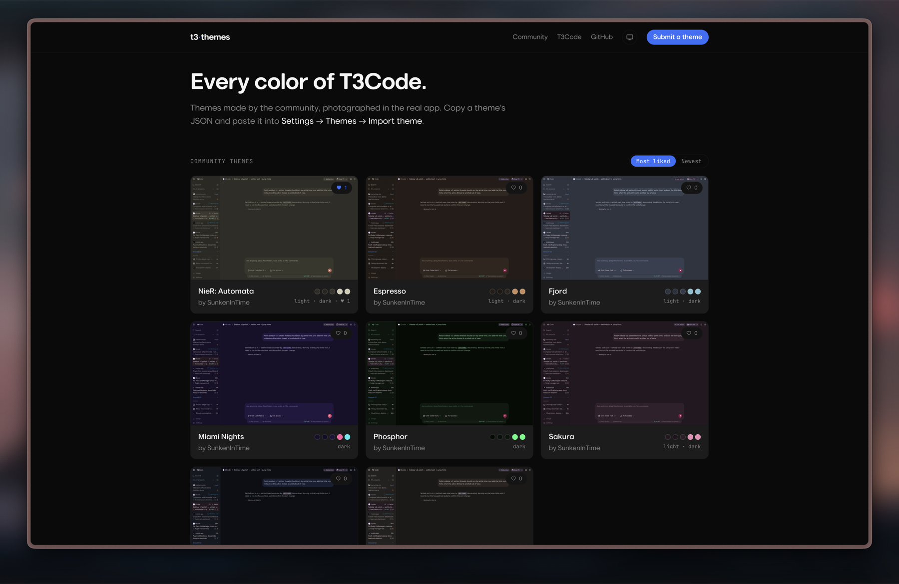

# T3 Themes

**[t3themes.com](https://t3themes.com)** — a community gallery of custom themes
for [T3Code](https://github.com/pingdotgg/t3code).



Every theme is **photographed inside the real T3Code app** (light and dark),
and every theme page embeds a **live, explorable T3Code demo** wearing that
theme. Sort by likes or newest, sign in with GitHub to like, copy a theme's
JSON, and paste it into **Settings → Themes → Import theme**.

## Submit a theme

Go to **[t3themes.com/submit](https://t3themes.com/submit)**: paste the JSON
exported from T3Code, see it validated with the app's own parser and previewed
in the real UI, then open a prefilled pull request — no git knowledge needed.

Prefer doing it by hand (or you're a coding agent)? Follow
[`docs/contributing-a-theme.md`](docs/contributing-a-theme.md) — one new
`themes/<id>.json` file, `npm run validate` must pass, touch nothing else.

Rules enforced by CI on every PR:

- The file is parsed by T3Code's actual `parseThemeFile` — green check means
  the theme imports cleanly into the app.
- The `author` field must be the PR opener's GitHub username, and only a
  theme's author may modify or delete it later (maintainers can override with
  the `override-ownership` label).

Merging is automatic too: a scheduled workflow merges any open theme PR that
touches exactly one theme file with all checks green (maintainers can add the
`hold` label to keep one open for manual review). After merge, CI screenshots
the theme in the real app, publishes the assets, and redeploys the site —
submission to live typically takes under an hour with no human in the loop.

## How it works

- **Astro static site** on Cloudflare Pages; themes are JSON files in
  [`themes/`](themes/). The only backend is [Convex](https://convex.dev) for
  likes (GitHub sign-in via Convex Auth; one like per theme per account).
- **`src/vendor/t3code/`** contains `themePalette.ts` and `ThemeWireframe.tsx`
  vendored verbatim from the MIT-licensed t3code repo, kept current daily by
  the `sync-vendor` workflow. Validation, previews, and the site's own styling
  (CSS `--app-theme-*` variables + `light-dark()`) all run on the app's real
  theme engine — theme detail pages literally *wear* the theme they show.
- **The live preview** is T3Code's demo build: the actual web app bundled
  against an in-browser mock server. It shares the site's localStorage, so
  pages inject a theme under T3Code's own keys and the app applies it as if
  you'd imported it — including themes pasted into `/submit` that don't exist
  anywhere yet.
- **The `build-demo-assets` workflow** builds that demo bundle, photographs
  every theme in both modes with headless Chromium, publishes everything to
  the rolling [`demo-assets` release](../../releases/tag/demo-assets), and
  triggers a site redeploy. Deploys just download the tarball
  (`scripts/fetch-demo-assets.sh`) instead of rebuilding the t3code monorepo.

## Development

```bash
npm install
bash scripts/fetch-demo-assets.sh   # prebuilt demo + screenshots (optional)
npm run dev                          # localhost:4321
npm run validate                     # what CI runs against themes/
npm run build                        # static build to dist/
```

Without the fetched assets the site still builds — pages fall back to
wireframe previews. `npm run shots` regenerates screenshots locally (needs the
demo bundle); `scripts/sync-demo.sh` rebuilds the demo bundle itself from the
t3code repo (needs pnpm).

Likes need `PUBLIC_CONVEX_URL` in `.env.local` and a Convex dev deployment
(`npx convex dev`). After changing anything in `convex/`, run
`npx convex deploy` to update production.

### Production notes

- Host: Cloudflare Pages, build command
  `bash scripts/fetch-demo-assets.sh && npm run build`, output `dist`, env
  `PUBLIC_CONVEX_URL` + `NODE_VERSION=22`.
- Convex production deployment holds the auth env (`AUTH_GITHUB_ID/SECRET`,
  `JWT_PRIVATE_KEY`/`JWKS`, `SITE_URL`); the GitHub OAuth app's callback is
  `https://<deployment>.convex.site/api/auth/callback/github`.
- The `CLOUDFLARE_DEPLOY_HOOK` repo secret lets the assets workflow redeploy
  the site when screenshots change.

---

Not affiliated with T3 Tools. Preview components and the demo build come from
the MIT-licensed [t3code](https://github.com/pingdotgg/t3code) repository.
